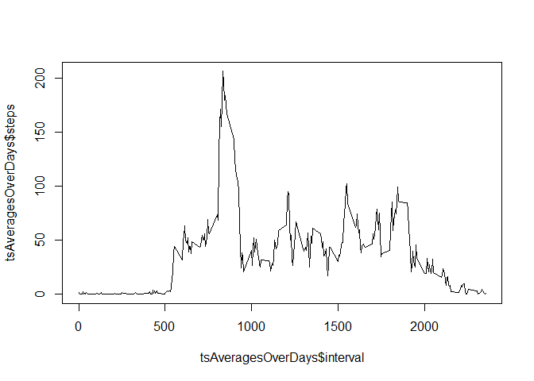

# Reproducible Research: Peer Assessment 1

## Loading and preprocessing the data

```r
if(!file.exists("./activity.csv")){
        unzip("./activity.zip")
        ; 
}
activityDF<-read.csv("activity.csv")
```

## What is the mean total number of steps taken per day?
A histogram of the total number of steps taken each day

```r
totStepsPerDay<-aggregate(steps ~ date,activityDF,FUN=sum)

library('ggplot2')
ggplot(totStepsPerDay, aes(x=steps)) + geom_histogram(binwidth = 1000)
```

 

The mean number of steps taken per day is:

```r
mean(totStepsPerDay$steps)
```

```
## [1] 10766
```

The median number of steps taken per day is:

```r
median(totStepsPerDay$steps)
```

```
## [1] 10765
```

## What is the average daily activity pattern?

Timeseries of the 5-minute interval (x-axis) and the average number of steps taken, averaged across all days (y-axis):

```r
tsAveragesOverDays<-aggregate(steps~interval,activityDF,FUN=mean)
plot(tsAveragesOverDays$interval,tsAveragesOverDays$steps,type='l')
```

 

The 5-minute interval which contains the most steps, averaged over each day:

```r
tsAveragesOverDays$interval[which.max(tsAveragesOverDays$steps)]
```

```
## [1] 835
```
## Imputing missing values

### Total number of rows with NA
Total missing values in the dataset:

```r
sum(is.na(activityDF$steps))
```

```
## [1] 2304
```
###Create a newest dataset that is equal to the original dataset but with the missing data filled in.

Replacing the NA-values with the average steps taken during that specific interval of the other days:

```r
activityDFNAReplaced<-merge(activityDF,tsAveragesOverDays,by='interval')
naindex <- which(is.na(activityDF$steps)==TRUE) 
activityDF$steps[naindex] <-activityDFNAReplaced$steps.y[naindex]
activityDFNAReplaced$steps.x[is.na(activityDFNAReplaced$steps.x)] <- activityDFNAReplaced$steps.y[is.na(activityDFNAReplaced$steps.x)]
names(activityDFNAReplaced)[2] <- "steps"
activityDFNAReplaced$steps.y<-NULL
```

Now the total number of missing values in the dataset is:

```r
sum(is.na(activityDFNAReplaced$steps))
```

```
## [1] 0
```

###Make a histogram of the total number of steps taken each day and Calculate and report the mean and median total number of steps taken per day. Do these values differ from the estimates from the first part of the assignment? What is the impact of imputing missing data on the estimates of the total daily number of steps?

```r
totStepsPerDay2<-aggregate(steps ~ date,activityDFNAReplaced,FUN=sum)
ggplot(totStepsPerDay2, aes(x=steps)) + geom_histogram(binwidth = 1000)
```

 

the mean amount of steps per day:

```r
mean(totStepsPerDay2$steps)
```

```
## [1] 10766
```

the median amount of steps per day:

```r
median(totStepsPerDay2$steps)
```

```
## [1] 10766
```

## Are there differences in activity patterns between weekdays and weekends?

###Create a newest factor variable in the dataset with two levels - "weekday" and "weekend" indicating whether a given date is a weekday or weekend day.

Creating new factor determining whether day was weekday or weekend:

```r
activityDFNAReplaced$day<-weekdays(as.Date(activityDFNAReplaced$date))
activityDFNAReplaced$type<-as.factor(ifelse(activityDFNAReplaced$day %in% c('zaterdag','zondag'),"weekend","week"))
```

panelplot showing the mean timeseries, divided by weekdays and weekends:

```r
library(lattice)
xyplot(steps~interval|type,data=activityDFNAReplaced,type="l",layout=c(1,2))
```

 
